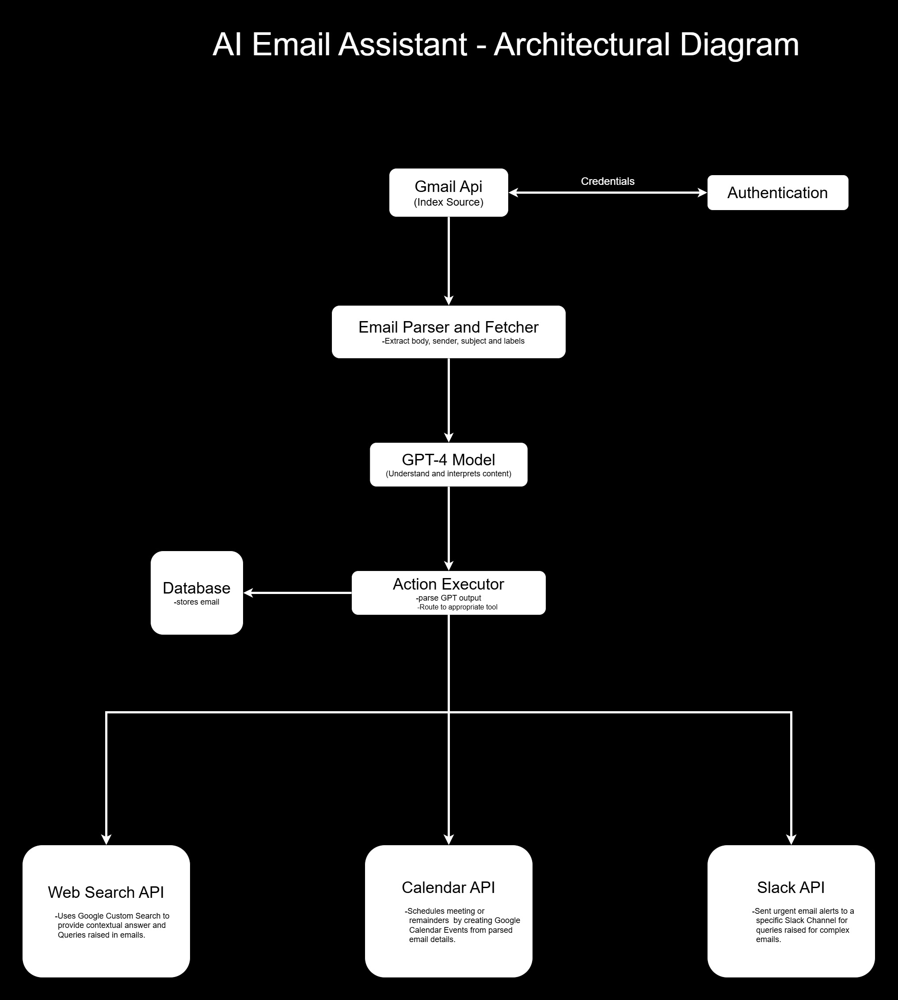

# 📬 **Intelligent Email Assistant**

An AI-powered email assistant that:
- Reads and processes emails using the Gmail API
- Summarizes messages and drafts replies with GPT-4
- Detects urgency and sends Slack alerts
- Extracts meeting details and creates Google Calendar events
- Performs web searches for question-based emails


## 🧠 Features

- ✅ **Simple Mail Handling**: Auto-replies to simple emails using template-based logic.
- 🧠 **Complex Mail Handling**: Uses OpenAI's GPT-4 to draft context-aware replies.
- 🔥 **Urgent Mail Detection**: Flags and prioritizes emails that are time-sensitive or critical.
- 🗃️ **Database Logging**: Saves email metadata and status into a database (SQLite, PostgreSQL, etc.).
- 🔔 **Slack Integration**: Sends real-time alerts for urgent or complex emails.
- 📅 **Calendar Integration**: Schedules follow-ups for emails requiring meetings or reminders.

## 🏗️ Architectural Diagram




## 📦 Tech Stack


This project integrates multiple technologies to build an intelligent email assistant that reads, classifies, responds to, and schedules emails with human-like intelligence. Below is the complete breakdown of the tech stack used:

---

### ✉️ Email Handling  
**Technology**: [Gmail API](https://developers.google.com/gmail/api)  
**Purpose**:  
Used to access, read, send, and manage emails from the user's Gmail account.  
- Reads inbox messages via REST API  
- Sends replies or new messages  
- Searches for specific threads or labels  
- Parses metadata and content (subject, body, sender)

---

### 🧠 AI & Natural Language Processing  
**Technology**: [OpenAI GPT-4](https://platform.openai.com/docs/guides/gpt)  
**Purpose**:  
Used for analyzing the content of the emails.  
- Summarizes lengthy emails  
- Detects sentiment and urgency  
- Generates smart replies  
- Understands user context (e.g., meetings, follow-ups)

---

### 🗂️ Database  
**Technology**: SQLite (for local dev) 
**Purpose**:  
Stores metadata and processed results for emails, such as:  
- Email ID, timestamp, urgency level  
- Generated replies and actions  
- Flags for follow-up, calendar events, or Slack alerts

---

### 🛎️ Notification System  
**Technology**: [Slack Webhooks](https://api.slack.com/messaging/webhooks)  
**Purpose**:  
Sends real-time notifications to a Slack channel when:  
- An email is marked as urgent  
- A reply is generated  
- User intervention is required

---

### 📅 Calendar Integration  
**Technology**: [Google Calendar API](https://developers.google.com/calendar/api)  
**Purpose**:  
Schedules meetings or reminders directly from emails.  
- Parses dates/times from mail  
- Creates events or meetings  
- Sends invites automatically

---

### 🧰 Backend  
**Technology**: Python (Script-based)  
**Purpose**:  
Acts as the core orchestrator that glues all the pieces together.  
- Fetches and processes emails  
- Connects GPT API, Gmail API, Slack, Calendar  
- Applies business logic like “urgent” detection

---

### 🔐 Authentication  
**Technology**: OAuth 2.0  
**Purpose**:  
Securely connects the user's Gmail and Calendar accounts.  
- Authenticates Gmail/Google APIs  
- Handles token refreshes  
- Ensures user data protection


---

### 🧰 Core Components

| Component            |   Technology          |
|------------------|---------------------|
| Email Client     | Gmail API           |
| NLP/AI Model     | OpenAI GPT-4        |
| Database         | SQLite|
| Notification     | Slack Webhooks      |
| Scheduling       | Google Calendar API |
| Backend          | Python (Script-based) |
| Auth             | OAuth 2.0           |


---

## ⚙️ Setup Instructions

Follow the steps below to set up and run the Intelligent Email Assistant on your local machine.


### 1️⃣ Clone the Repository


```bash
git clone https://github.com/yourusername/intelligent-email-assistant.git
cd intelligent-email-assistant
```

### 2️⃣ Create a Virtual Environment

```bash
python -m venv venv
source venv/bin/activate  # For Linux/macOS
venv\Scripts\activate     # For Windows
```

### 3️⃣ Install Dependencies
```bash
pip install -r requirements.txt
```

### 4️⃣ Set Up Environment Variables
Create a .env file in the root directory and add the following:
```bash
GMAIL_API_CLIENT_ID=your-client-id
GMAIL_API_CLIENT_SECRET=your-client-secret
OPENAI_API_KEY=your-openai-api-key
SLACK_WEBHOOK_URL=your-slack-webhook-url
CALENDAR_API_KEY=your-calendar-api-key
DATABASE_URL=sqlite:///emails.db
```

### 5️⃣ Configure Google & OpenAI APIs

#### 📧 Gmail API

1. Go to the [Google Cloud Console](https://console.cloud.google.com/).
2. Create a new project or select an existing one.
3. Navigate to **APIs & Services > Library**.
4. Search for **Gmail API** and click **Enable**.
5. Go to **APIs & Services > Credentials**.
6. Click **Create Credentials** > **OAuth client ID**.
7. Download the `credentials.json` file.
8. Place the `credentials.json` file in the root directory of your project.

---

#### 🗓️ Google Calendar API

1. In the same Google Cloud project, navigate to **APIs & Services > Library**.
2. Search for **Google Calendar API** and enable it.
3. Use the **same `credentials.json`** file created above for authentication.

---

#### 🤖 OpenAI API

1. Sign up or log in at [OpenAI](https://platform.openai.com/).
2. Go to your API keys section: [https://platform.openai.com/account/api-keys](https://platform.openai.com/account/api-keys).
3. Click **Create new secret key** and copy the key.
4. Add the key to your `.env` file like this:

```dotenv
OPENAI_API_KEY=your-openai-api-key
```

### 6️⃣ Run the App
```bash
python main.py
```

## 📬 Email Flow – Step-by-Step


### 1. **Receive New Emails**
- The system uses the **Gmail API** to fetch unread emails periodically (e.g., every 1 minute using a cron or scheduler).
- Emails are fetched via OAuth 2.0 authentication using `credentials.json`.

```python
# Pseudocode
emails = gmail.fetch_unread_emails()
```

### 2. **Preprocess Emails**
- Each email is parsed to extract:
  - `Sender`
  - `Subject`
  - `Body`
  - `Timestamp`
  - `Attachments` (if any)
- Clean the email body (remove HTML, trim signatures, etc.).

```python
cleaned_text = preprocess(email.body)
```

### 3. **Classify Email Type (Simple / Complex / Urgent)**
- Send the cleaned email content to OpenAI GPT-4 via API.
- Use prompts to determine:
  - Is it a simple query that can be answered automatically?
  - Is it complex and needs human intervention?
  - Is it urgent?
```python
response = openai.ChatCompletion.create(
  model="gpt-4",
  messages=[
    {"role": "system", "content": "Classify email: Simple, Complex, or Urgent."},
    {"role": "user", "content": cleaned_text}
  ]
)

```

### 4. **Mark Urgency**
- If marked Urgent, trigger an immediate Slack alert:
```python
slack.send_message("🚨 Urgent Email from [Sender]: [Subject]")
```


### 5. **Store in Database**
- Store the email metadata, classification, and GPT-generated summary in SQLite.
- Mark status: `Pending`, `Replied`, `Escalated`.

```python
INSERT INTO emails (sender, subject, body, type, urgency, timestamp, status)
VALUES (?, ?, ?, ?, ?, ?, ?)
```

### 6. **Generate Reply (For Simple Emails)**
- If classified as Simple, GPT-4 generates a reply.
- Automatically draft or send reply via Gmail API.

```python
draft = gpt.generate_reply(cleaned_text)
gmail.send_email(to=sender, subject=reply_subject, body=draft)
```


### 7. **Human Review (For Complex Emails)**
- If email is Complex, notify the support team via Slack:
```python
slack.send_message("🧠 Complex Email needs review:\n[Subject]\n[Summary]")
```
- Assign to a human agent and track in database.


### 8. **Scheduling (Depends)**
- If the email involves meeting requests or time-sensitive follow-ups:
  - Extract date/time using NLP.
  -Create an event using Google Calendar API.

```python
calendar.create_event(title, date, time, attendees)
```


### 9. **Status Update**
- Update email status after reply, review, or calendar scheduling.


## ⚠️ Error Handling

- ✅ OAuth token refresh automatically handled for Gmail & Calendar APIs.

- 🔁 GPT-4 fallback logic:
  - Retries on rate limits or temporary outages.
  - Notifies via Slack if OpenAI API fails after multiple attempts.

- 📤 Email Sending:
  - Fails gracefully if sending fails.
  - Logs issue and notifies user via Slack.

- 🗓️ Google Calendar:
  - Catches and logs errors if calendar event creation fails.
  - Continues workflow without crashing the assistant.

- 💬 Slack Notifications:
  - Wrapped in try-except to prevent breaking the flow.
  - Errors logged, not propagated.

- 🗃️ Database:
  - Commits only on successful operations.
  - Rolls back on query failure or constraint violation.

- 📦 Missing Configuration:
  - Throws descriptive errors if `.env` or `credentials.json` are missing.

- 🔄 Retry Decorator:
  - Used in critical API calls like Gmail fetch and GPT classify to auto-retry on failure.


## ✅ Conclusion

- This intelligent email assistant combines the power of Gmail, OpenAI's GPT-4, Slack, and Google Calendar to automate, prioritize, and simplify email handling. 
- From detecting urgency and classifying intent to notifying users and scheduling events, the assistant ensures smoother workflows with minimal manual intervention.
- Whether you're looking to enhance productivity, reduce email clutter, or integrate smart automation into your daily tools — this project provides a scalable, extensible foundation to build upon.


## 🧑‍💻 Author
Made by Aditya Karan 


